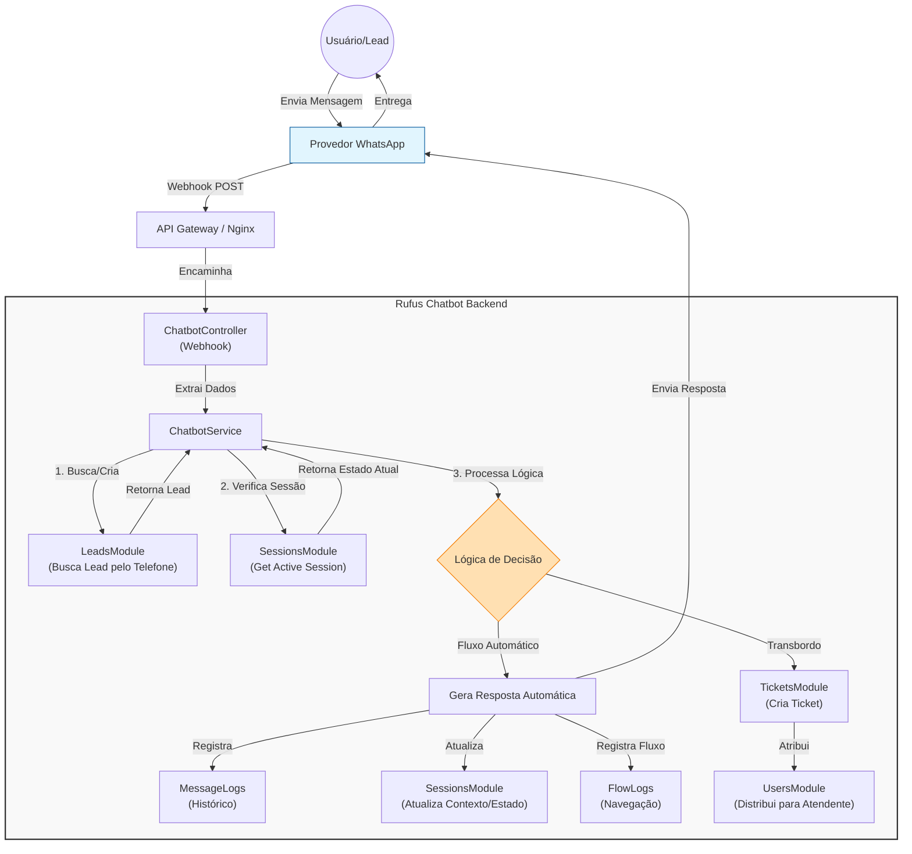

# Fluxograma da Aplicação Rufus Chatbot

Este diagrama ilustra o fluxo de processamento de uma mensagem recebida e a interação entre os módulos do sistema.

```mermaid
graph TD
    %% Atores Externos
    User(("Usuário/Lead")) -->|Envia Mensagem| WA["Provedor WhatsApp"]
    WA -->|Webhook POST| API["API Gateway / Nginx"]
    API -->|Encaminha| WebhookController["ChatbotController<br>(Webhook)"]

    %% Fluxo Principal
    subgraph Backend ["Rufus Chatbot Backend"]
        WebhookController -->|Extrai Dados| Service["ChatbotService"]
        
        Service -->|1. Busca/Cria| LeadService["LeadsModule<br>(Busca Lead pelo Telefone)"]
        LeadService -->|Retorna Lead| Service
        
        Service -->|2. Verifica Sessão| SessionService["SessionsModule<br>(Get Active Session)"]
        SessionService -->|Retorna Estado Atual| Service
        
        Service -->|3. Processa Lógica| Logic{"Lógica de Decisão"}
        
        %% Caminhos da Lógica
        Logic -->|Fluxo Automático| BotResponse["Gera Resposta Automática"]
        Logic -->|Transbordo| TicketService["TicketsModule<br>(Cria Ticket)"]
        
        %% Persistência
        BotResponse -->|Registra| MsgLog["MessageLogs<br>(Histórico)"]
        BotResponse -->|Atualiza| SessionUpdate["SessionsModule<br>(Atualiza Contexto/Estado)"]
        BotResponse -->|Registra Fluxo| FlowLog["FlowLogs<br>(Navegação)"]
        
        TicketService -->|Atribui| UserService["UsersModule<br>(Distribui para Atendente)"]
    end

    %% Retorno
    BotResponse -->|Envia Resposta| WA
    WA -->|Entrega| User

    %% Estilização
    style Backend fill:#f9f9f9,stroke:#333,stroke-width:2px
    style Logic fill:#ffe0b2,stroke:#f57c00
    style WA fill:#e1f5fe,stroke:#01579b
```
